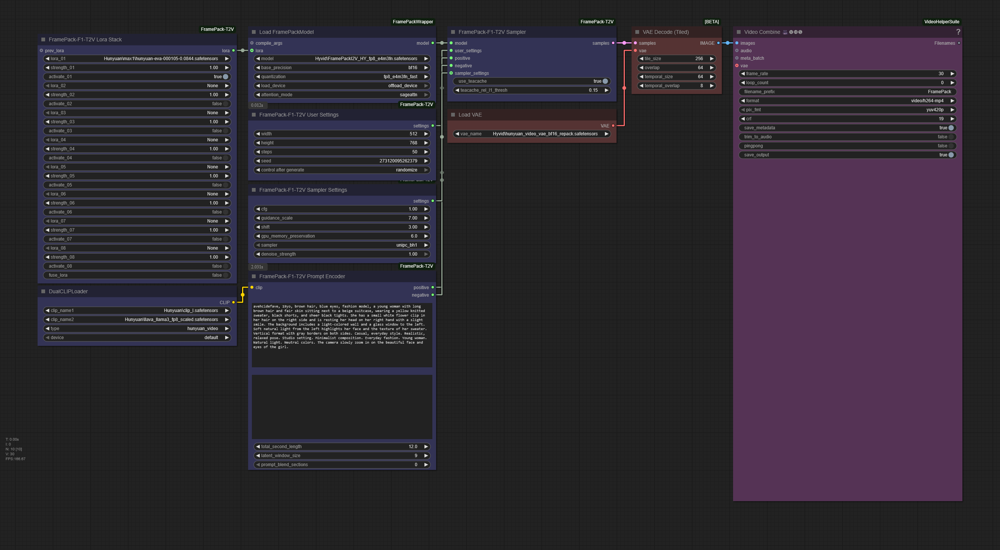

# ComfyUI-FramePack-F1-T2V
A set of custom nodes enabling Text-to-Video support for FramePack-F1 based on community works.

### 27.05.2025 - First release

- Simplification of the FramePack Sampler into **FramePack-F1-T2V Sampler**
- Separation of few sampler parameters into a separated node **FramePack-F1-T2V Sampler Settings**
- Addition of a new Text-2-Video settings node into **FramePack-F1-T2V User Settings**
- Extension of the Lora Selector to 8 LoRA's **FramePack-F1-T2V Lora Stack**
- Integration of the Timestamped Text Encoder as **FramePack-F1-T2V Prompt Encoder**

This set of custom nodes is based on the combined works of : [lllyasviel](https://github.com/lllyasviel), [kijai](https://github.com/kijai), [siraxe](https://github.com/siraxe), [kabachuha](https://github.com/kabachuha) and [tdrussell](https://github.com/tdrussell).

## Installation

#### Installation via ComfyUI-Manager

Installation via [ComfyUI-Manager](https://github.com/ltdrdata/ComfyUI-Manager) is preferred. Simply search for `ComfyUI-FramePack-F1-T2V` in the list of nodes.

#### Manual installation

Simply clone this repository to `custom-nodes` folder in your ComfyUI installation directory.

## Worflow

## Credits and greetings

- [lllyasviel](https://github.com/lllyasviel) for the **FramePack** project ([here](https://github.com/lllyasviel/FramePack)).
- [kijai](https://github.com/kijai) for the **ComfyUI-FramePackWrapper** ([here](https://github.com/kijai/ComfyUI-FramePackWrapper)).
- [kabachuha](https://github.com/kabachuha) for the F1 support ([here](https://github.com/kijai/ComfyUI-FramePackWrapper/pull/13))
- [siraxe](https://github.com/siraxe) for the timestamps support ([here](https://github.com/kijai/ComfyUI-FramePackWrapper/pull/14))
- [tdrussell](https://github.com/tdrussell) for the T2V and lora fixes ([here](https://github.com/kijai/ComfyUI-FramePackWrapper/pull/11))
